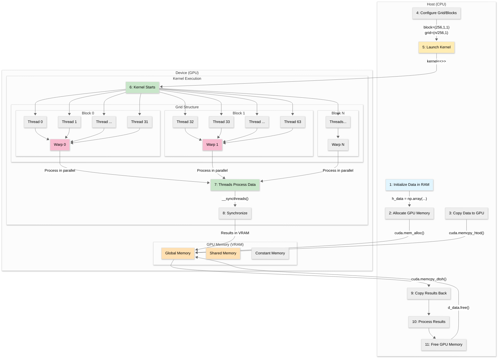

```mermaid
---
config:
  theme: neutral
  look: neo
---
flowchart TB
 subgraph subGraph0["Host (CPU)"]
        H1["1: Initialize Data in RAM"]
        H2["2: Allocate GPU Memory"]
        H3["3: Copy Data to GPU"]
        H4["4: Configure Grid/Blocks"]
        H5["5: Launch Kernel"]
        H9["9: Copy Results Back"]
        H10["10: Process Results"]
        H11["11: Free GPU Memory"]
  end
 subgraph subGraph1["GPU Memory (VRAM)"]
        GM["Global Memory"]
        SM["Shared Memory"]
        CM["Constant Memory"]
  end
 subgraph subGraph2["Block 0"]
        T0["Thread 0"]
        T1["Thread 1"]
        T2["Thread ..."]
        T31["Thread 31"]
        W0["Warp 0"]
  end
 subgraph subGraph3["Block 1"]
        T32["Thread 32"]
        T33["Thread 33"]
        T34["Thread ..."]
        T63["Thread 63"]
        W1["Warp 1"]
  end
 subgraph subGraph4["Block N"]
        TN["Threads..."]
        WN["Warp N"]
  end
 subgraph subGraph5["Grid Structure"]
        subGraph2
        subGraph3
        subGraph4
  end
 subgraph subGraph6["Kernel Execution"]
        K1["6: Kernel Starts"]
        subGraph5
        K2["7: Threads Process Data"]
        K3["8: Synchronize"]
  end
 subgraph subGraph7["Device (GPU)"]
        subGraph1
        subGraph6
  end
    H1 -- "h_data = np.array(...)" --> H2
    H2 -- "cuda.mem_alloc()" --> GM
    H3 -- "cuda.memcpy_htod()" --> GM
    H4 -- "block=(256,1,1)<br>grid=(n/256,1)" --> H5
    H5 -- kernel&lt;&lt;&gt;&gt; --> K1
    K1 --> T0 & T1 & T2 & T31 & T32 & T33 & T34 & T63 & TN
    T0 --> W0
    T1 --> W0
    T2 --> W0
    T31 --> W0
    T32 --> W1
    T33 --> W1
    T34 --> W1
    T63 --> W1
    TN --> WN
    W0 -- Process in parallel --> K2
    W1 -- Process in parallel --> K2
    WN -- Process in parallel --> K2
    K2 -- __syncthreads() --> K3
    K3 -- Results in VRAM --> GM
    GM -- "cuda.memcpy_dtoh()" --> H9
    H9 --> H10
    H10 --> H11
    H11 -- "d_data.free()" --> GM
    style H1 fill:#e1f5fe
    style H5 fill:#ffecb3
    style GM fill:#ffe0b2
    style SM fill:#ffe0b2
    style W0 fill:#f8bbd0
    style W1 fill:#f8bbd0
    style K1 fill:#c8e6c9
    style K2 fill:#c8e6c9

```