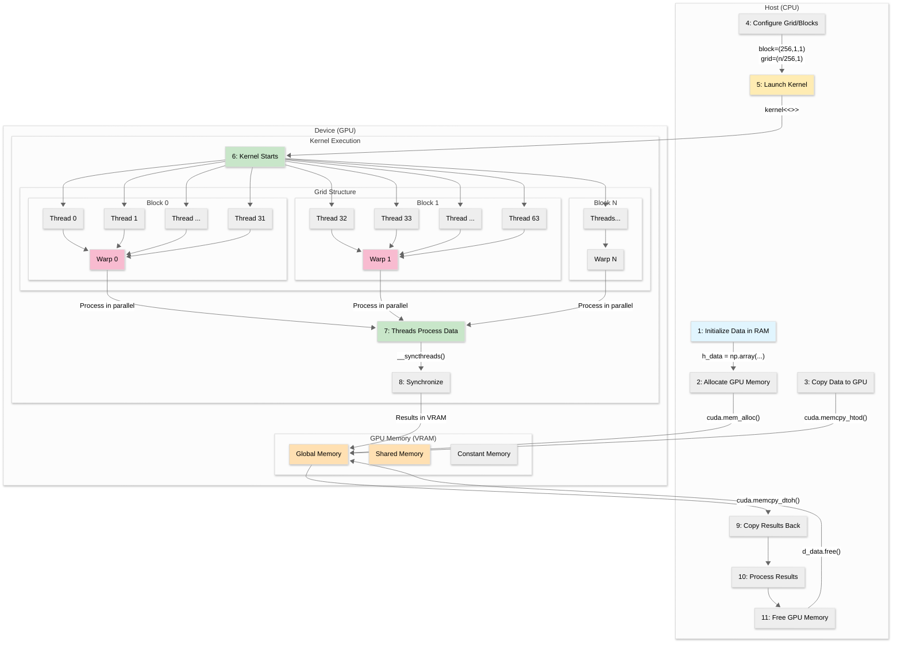

## CUDA Execution Flow Walkthrough

This diagram visualizes the life cycle of a typical CUDA program: how data and control move between the **host (CPU)** and the **device (GPU)**, and how massively parallel thread execution is organized internally on the GPU.

### Phase 1: Host Initialization (Steps 1–3)

1. Initialize Data in RAM (H1)
      - Create input arrays (e.g., NumPy) on the CPU.  
      - Example: `h_data = np.array([...], dtype=np.float32)`.
2. Allocate GPU Memory (H2 → Global Memory)
      - Reserve space on the device using something like `d_data = cuda.mem_alloc(h_data.nbytes)`.
      - No data is copied yet—just allocation in **Global Memory**.
3. Copy Data to GPU (H3)
      - Transfer host data to device: `cuda.memcpy_htod(d_data, h_data)`.
      - Data now exists in both host RAM and device VRAM.

### Phase 2: Launch Configuration (Steps 4–5)

4. Configure Grid / Blocks (H4)
      - Decide how many threads per block (`blockDim`) and how many blocks (`gridDim`).  
      - Example: `block=(256,1,1)` and `grid=((n + 255)//256, 1)`.
      - This partitions the problem domain across thousands of lightweight threads.
5. Launch Kernel (H5 → K1)
      - Invoke GPU parallel work: `kernel<<<grid, block>>>(...)` (PyCUDA builds an equivalent launch via function call with grid/block arguments).
      - Launch is asynchronous: the CPU can proceed unless you explicitly synchronize.

### Phase 3: Device Execution (Steps 6–8)

6. Kernel Starts (K1)
      - GPU schedules blocks across Streaming Multiprocessors (SMs).
      - Each block contains many threads; internally, threads are grouped into **warps** of 32 for execution (W0, W1, … WN).
7. Threads Process Data (K2)
      - Each thread computes its global index: `idx = threadIdx.x + blockIdx.x * blockDim.x`.
      - Loads from Global Memory; may stage data in **Shared Memory** (fast, per-block) for reuse.
      - May read from **Constant Memory** for broadcasted read-only values.
      - Writes results back to Global Memory.
      - Warps execute in lockstep (SIMT). Divergent branches serialize execution within that warp.
8. Synchronize (K3)
      - Optional barrier (`__syncthreads()`) ensures all threads in a block reach a point before using shared results.
      - After computation, results reside in Global Memory (GM node).

### Phase 4: Retrieval & Cleanup (Steps 9–11)

9. Copy Results Back (H9)
      - Host pulls processed data: `cuda.memcpy_dtoh(h_out, d_data)`.
10. Process Results (H10)
      - CPU-side post-processing: visualization, aggregation, saving to disk, further algorithmic steps.
11. Free GPU Memory (H11)
      - Release allocations: `d_data.free()` (or rely on context cleanup).
      - Prevents VRAM leaks over long-running sessions.

### Memory Components Highlighted

- Global Memory (GM): Large, high latency, accessible by all threads.
- Shared Memory (SM): Low latency, per-block scratchpad (cooperation & tiling).
- Constant Memory (CM): Read-only cached, best for uniform access across warps.
- (Not shown explicitly): Registers (per-thread, fastest) and Local Memory (spill / private arrays).

### Thread & Warp Organization

- Threads are grouped into blocks (subGraph2 / subGraph3 / subGraph4).
- 32 consecutive threads form a warp (W0, W1, WN).  
- All threads in a warp execute the same instruction sequence; divergence causes serialized execution paths.
- Efficient kernels minimize divergence and coalesce global memory accesses (contiguous thread indices accessing adjacent addresses).

### Performance Considerations (Implied by Flow)

- Minimize host↔device transfers (Steps 3 & 9 are bandwidth-bound via PCIe).  
- Maximize arithmetic intensity inside the kernel (Step 7).  
- Use shared memory to reduce redundant global loads.  
- Align grid/block dimensions with problem size (avoid large numbers of idle threads).  
- Consider asynchronous streams for overlapping copies and computation (advanced extension of flow shown).

### Example PyCUDA Skeleton Corresponding to Flow

```python
import numpy as np
import pycuda.autoinit  # Context setup
import pycuda.driver as cuda
from pycuda.compiler import SourceModule

kernel_src = """
__global__ void scale(float *data, int n) {
       int idx = threadIdx.x + blockIdx.x * blockDim.x;
       if (idx < n) {
              data[idx] *= 2.0f;
       }
}
"""

mod = SourceModule(kernel_src)
kernel = mod.get_function("scale")

n = 1_000_000
h_data = np.random.rand(n).astype(np.float32)

d_data = cuda.mem_alloc(h_data.nbytes)          # Step 2
cuda.memcpy_htod(d_data, h_data)                # Step 3

block = (256, 1, 1)                             # Step 4
grid = ((n + block[0] - 1) // block[0], 1)      # Step 4
kernel(d_data, np.int32(n), block=block, grid=grid)  # Step 5–8

cuda.memcpy_dtoh(h_data, d_data)                # Step 9
d_data.free()                                   # Step 11
```

### When to Synchronize

- Some operations (like timing with events) require explicit `cuda.Context.synchronize()` or event synchronization.
- Implicit sync occurs on certain API calls (e.g., copying device→host often waits for prior kernels touching that memory).

### Extending This Flow

- Streams: Overlap transfer and compute.
- Unified Memory: Abstract away explicit copies (still incurs migration costs).
- Graphs: Pre-record execution dependencies for reduced launch overhead.

---
This walkthrough complements the diagram by mapping each numbered node to concrete API concepts and performance implications; together they provide both structural and procedural understanding of CUDA execution.
