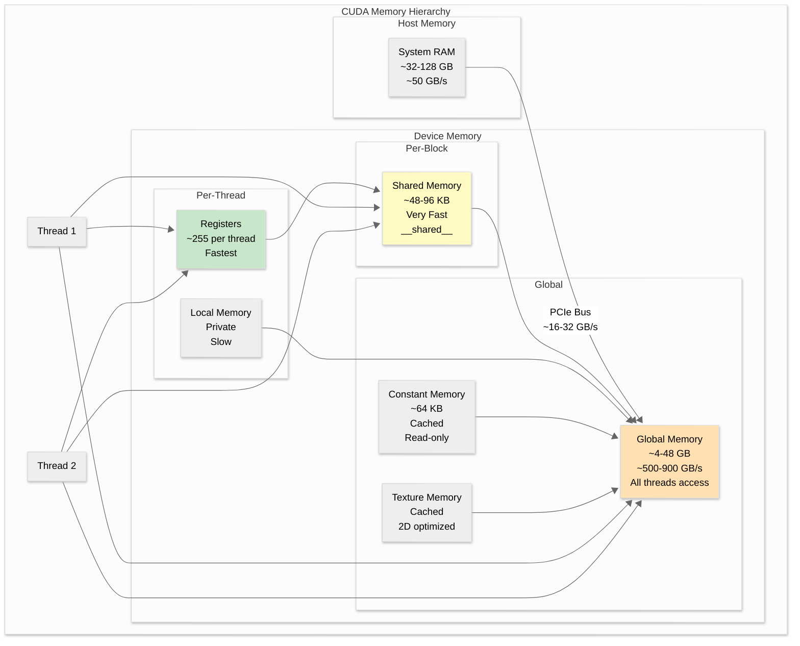

```mermaid
---
config:
  theme: neutral
  look: neo
---
graph TD
    subgraph "CUDA Memory Hierarchy"
        subgraph "Host Memory"
            RAM[System RAM<br/>~32-128 GB<br/>~50 GB/s]
        end
        
        subgraph "Device Memory"
            subgraph "Per-Thread"
                REG[Registers<br/>~255 per thread<br/>Fastest]
                LOCAL[Local Memory<br/>Private<br/>Slow]
            end
            
            subgraph "Per-Block"
                SHARED[Shared Memory<br/>~48-96 KB<br/>Very Fast<br/>__shared__]
            end
            
            subgraph "Global"
                GLOBAL[Global Memory<br/>~4-48 GB<br/>~500-900 GB/s<br/>All threads access]
                CONST[Constant Memory<br/>~64 KB<br/>Cached<br/>Read-only]
                TEX[Texture Memory<br/>Cached<br/>2D optimized]
            end
        end
        
        RAM -->|"PCIe Bus<br/>~16-32 GB/s"| GLOBAL
        
        REG --> SHARED
        SHARED --> GLOBAL
        LOCAL --> GLOBAL
        CONST --> GLOBAL
        TEX --> GLOBAL
        
        T1[Thread 1] --> REG
        T2[Thread 2] --> REG
        T1 & T2 --> SHARED
        T1 & T2 --> GLOBAL
    end
    
    style REG fill:#c8e6c9
    style SHARED fill:#fff9c4
    style GLOBAL fill:#ffe0b2
```