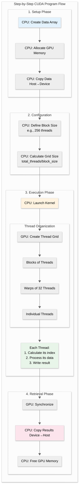

```mermaid
---
config:
  theme: neutral
  look: neo
---
flowchart LR
    subgraph "Step-by-Step CUDA Program Flow"
        direction TB
        
        subgraph "1. Setup Phase"
            A[CPU: Create Data Array] --> B[CPU: Allocate GPU Memory]
            B --> C[CPU: Copy Data Host→Device]
        end
        
        subgraph "2. Configuration"
            C --> D[CPU: Define Block Size<br/>e.g., 256 threads]
            D --> E[CPU: Calculate Grid Size<br/>total_threads/block_size]
        end
        
        subgraph "3. Execution Phase"
            E --> F[CPU: Launch Kernel]
            F --> G[GPU: Create Thread Grid]
            
            subgraph "Thread Organization"
                G --> H[Blocks of Threads]
                H --> I[Warps of 32 Threads]
                I --> J[Individual Threads]
            end
            
            J --> K[Each Thread:<br/>1. Calculate its index<br/>2. Process its data<br/>3. Write result]
        end
        
        subgraph "4. Retrieval Phase"
            K --> L[GPU: Synchronize]
            L --> M[CPU: Copy Results Device→Host]
            M --> N[CPU: Free GPU Memory]
        end
    end
    
    style A fill:#e3f2fd
    style F fill:#fff3e0
    style K fill:#e8f5e9
    style M fill:#fce4ec

```